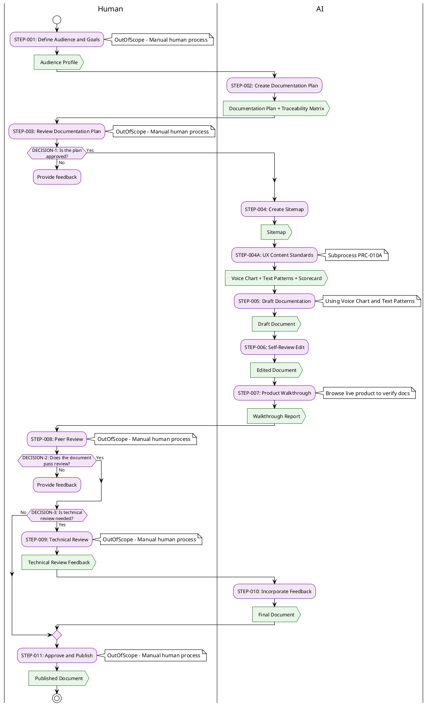

# PRC-010: Documentation Creation Process

## Purpose
Standardized process for teams to systematically create, review, and publish documentation. Based on the methodology from *Docs for Developers* (Bhatti et al., 2021) and adapted for the PRC framework.

## Process Overview

Fig 1: Documentation creation process overview

## Process Description

### STEP-001: Define Audience and Goals

#### Process Guidelines
- **Gather existing knowledge**: Collect emails, design docs, chat logs, code comments, support tickets related to the documentation subject
- **Define user goals**: Identify both business goals (what you want users to do) and user goals (what users want to accomplish)
- **Identify target users**: Define by role, experience level, programming languages, environment, and situation
- **Outline user needs**: List questions your documentation must answer
- **Validate understanding** (optional): Conduct user research through:
  - Support ticket analysis (group by: topic, process, user type, action)
  - Direct interviews (3-5 participants)
  - Developer surveys
- **Identify competitors**: List competitor products and their documentation sites for analysis in STEP-002
- **Condense findings** into:
  - User personas with IDs (USR-XXX: name, developer skill, languages, environment, role)
  - User stories with IDs: *"**US-XXX**: As a [type of user], I want [activity] so that I can [goal]"*
  - User journey map (optional, for complex products)
  - Friction log (optional, step-by-step experience record)

#### Output Description
- **Audience Profile** using [AUDIENCE_PROFILE_TEMPLATE.md](AUDIENCE_PROFILE_TEMPLATE.md)

### STEP-002: Create Documentation Plan

#### Process Guidelines
- **Select content types** for each document needed. Available types:

| Content Type              | When to Use                                    |
| ------------------------- | ---------------------------------------------- |
| README                    | Project overview, installation, quick start    |
| Getting Started           | First-time user onboarding                     |
| Conceptual                | Explain how things work, system design         |
| How-To Guide              | Step-by-step procedure for a specific task     |
| Tutorial                  | Guided learning exercise with test environment |
| API Reference             | Endpoint definitions, parameters, examples     |
| Troubleshooting           | Known issues and workarounds                   |
| Glossary                  | Term definitions for consistency               |
| Changelog / Release Notes | Record of changes over time                    |

- **Create content outline** as a table mapping each document (DOC-XXX) to its content type and brief description
- **Analyze competitor documentation**: For each competitor identified in the Audience Profile, evaluate their documentation coverage, strengths, weaknesses, and opportunities for differentiation
- **Validate content type coverage**: Complete the Content Type Validation Matrix to ensure all content types are consciously included or excluded with justification
- **Validate plan coherence**: Does the plan reflect a coherent user journey? If the plan feels like a maze, revisit user research
- **Build traceability matrix**: Map user stories (US-XXX) to documents (DOC-XXX) in both directions to identify coverage gaps and orphan documents
- **Plan questions to answer**:
  - Who is the target audience?
  - What features are being released (in priority order)?
  - What do users expect?
  - What prerequisite knowledge is needed?
  - What use cases are being supported?
  - Are there known friction points?

#### Output Description
- **Documentation Plan** using [DOCUMENTATION_PLAN_TEMPLATE.md](DOCUMENTATION_PLAN_TEMPLATE.md)
- **Traceability Matrix** using [TRACEABILITY_MATRIX_TEMPLATE.md](TRACEABILITY_MATRIX_TEMPLATE.md)

### STEP-003: Review Documentation Plan

- **Purpose**: Human reviews the documentation plan for completeness, coherence, and alignment with user needs
- **Responsibility**: Human (document owner, product stakeholder)
- Out of scope - manual human process

### STEP-004: Create Sitemap

#### Process Guidelines
- **Define folder structure**: Map each document to a file path within the docs directory, grouping related documents into subdirectories (e.g., `concepts/`, `guides/`)
- **Define navigation sidebar**: Specify how documents appear in the documentation site navigation
- **Map cross-links**: For each document, define:
  - **Previous**: The preceding document in the reading order
  - **Next**: The following document in the reading order
  - **Also Links To**: Other documents referenced within the content
- **Validate navigation flow**: Ensure the reading order reflects the user journey from the documentation plan

#### Output Description
- **Sitemap** defining folder structure, navigation sidebar, and document cross-links

### STEP-004A: UX Content Standards (Subprocess)

- **Purpose**: Establish consistent voice, tone, and writing standards before drafting begins
- **Responsibility**: AI (with human review and approval)
- **Subprocess**: Execute [PRC-010A: UX Content Standards Subprocess](prc-010a-ux-content-standards-subprocess.md)
- **Outputs**:
  - **Voice Chart** using [VOICE_CHART_TEMPLATE.md](VOICE_CHART_TEMPLATE.md)
  - **UX Text Patterns Guide** using [UX_TEXT_PATTERNS_TEMPLATE.md](UX_TEXT_PATTERNS_TEMPLATE.md)
  - **UX Content Scorecard** using [UX_CONTENT_SCORECARD_TEMPLATE.md](UX_CONTENT_SCORECARD_TEMPLATE.md)
- **Integration**: The Voice Chart and UX Text Patterns Guide are used as references during STEP-005 (Draft), STEP-006 (Self-Review), and STEP-007 (Product Walkthrough). The Content Scorecard is used as a verification tool in STEP-006 and STEP-007.

### STEP-005: Draft Documentation

#### Process Guidelines
- **For each document in the plan**, follow this sequence:
  1. **Set context**: Record audience, purpose, and content pattern at the top of the working draft
  2. **Define title**: Shortest, clearest rephrasing of the document's purpose from the user's perspective. One goal per document
  3. **Create outline**: List all steps/parts needed to reach the goal, then rearrange into logical flow
  4. **Complete outline**: Add prerequisites, sub-details, verification steps
  5. **Draft content** using these building blocks:

| Element | Guidelines |
|---|---|
| **Headers** | Brief, clear, specific; lead with most important info; unique per section; consistent style |
| **Paragraphs** | Max 5 sentences; provide context and details |
| **Procedures** | Numbered lists; one action per step; state starting state; end with verification |
| **Lists** | Group related info; max ~10 items; order by importance or alphabetically |
| **Callouts** | Warning (danger), Caution (unexpected consequences), Note (tips); use sparingly |
| **Screenshots** | Insert placeholder images for key UI moments using ``. Place after the step they illustrate. Placeholders are replaced with real screenshots in STEP-007. |

- **Write for skimming**: State most important info first; break up text with subheaders, lists, code samples
- **Use templates**: Apply the matching content type template from [CONTENT_TYPE_TEMPLATES.md](CONTENT_TYPE_TEMPLATES.md)
- **Getting unstuck strategies**: Write out of sequence, use [TODO] for gaps, ask for help, change medium

#### Output Description
- **Draft Document(s)** following the appropriate content type template

### STEP-006: Self-Review Edit

#### Process Guidelines
- Perform **four editing passes** in order:

**Pass 1: Technical Accuracy**
- Do instructions produce the promised result?
- Is technical jargon clear or explained?
- Are code functions, parameters, endpoints named correctly?
- Follow procedures yourself to verify they work

**Pass 2: Completeness**
- All necessary information present?
- No [TODO] or [TBD] remaining?
- Works across target environments?
- Version limitations documented?

**Pass 3: Structure**
- Clear from title and headers what document is about?
- Organized in consistent and logical way?
- Follows the content type template?
- Prerequisites stated? Next steps listed?

**Pass 4: Clarity and Brevity**
- Is this as clear as it can be?
- Terms used consistently?
- No unnecessary words, idioms, or biased language?

**Pass 5: Voice Compliance** *(requires completed PRC-010A outputs)*
- Does the content align with the Voice Chart product principles?
- Are UX Text Patterns applied consistently (titles, descriptions, errors, etc.)?
- Apply the four editing phases: Purposeful → Concise → Conversational → Clear
- Score the document using the UX Content Scorecard — minimum 70% to proceed

- Apply the **Self-Review Checklist**:
  - [ ] Title is short and specific
  - [ ] Headers are logically ordered and consistent
  - [ ] Purpose explained in the first paragraph
  - [ ] Procedures are tested and work
  - [ ] Technical concepts are explained or linked to
  - [ ] Document follows structure from templates
  - [ ] All links work
  - [ ] Spelling and grammar checked
  - [ ] Graphics and images are clear and useful
  - [ ] Prerequisites and next steps are defined

#### Output Description
- **Edited Document** with all checklist items addressed

### STEP-007: Product Walkthrough

#### Process Guidelines
- **Purpose**: Verify that all documentation is **followable** by walking through the live product and comparing each step against the docs
- **Responsibility**: AI (using browser automation to interact with the live product — see [TOOLS.md](TOOLS.md) for browser automation reference)
- **QC workflow**:
  1. **Create test cases and screenshot plan** (once per document, reuse across executions): Extract verifiable claims from the documentation and record them using the [WALKTHROUGH_TEST_CASE_TEMPLATE.md](WALKTHROUGH_TEST_CASE_TEMPLATE.md). Each test case should be a single verifiable claim (UI label, navigation path, URL, procedure outcome, screenshot accuracy, or API behavior). Additionally, scan all docs for `placehold.co` placeholder images and create a **screenshot capture plan** — a list of each placeholder with: the doc path, the section it appears in, the target filename (e.g., `images/signup-page.png`), and which product page/state needs to be visible when capturing. Order the list to match the walkthrough navigation sequence so screenshots can be captured in a single pass.
  2. **Execute test cases and capture screenshots in a single pass**: Walk through the live product following the navigation sequence from the screenshot plan. At each page or step: (a) verify the relevant test cases, (b) **immediately capture and save the screenshot** to `images/` before navigating away. Do not defer screenshot capture to a later pass — the right moment to capture is when you are already on the correct page. Record test results in a test execution file using the [WALKTHROUGH_TEST_EXECUTION_TEMPLATE.md](WALKTHROUGH_TEST_EXECUTION_TEMPLATE.md).
  3. **Replace screenshot placeholders**: For each `placehold.co` image in the docs, replace the placeholder URL with the local image path captured in step 2 (e.g., `images/screenshot-name.png`). **Never delete a placeholder without providing a replacement image.** If a screenshot could not be captured (e.g., requires specific data state), keep the placeholder and document the reason in the execution record.
  4. **Fix failures**: For each failed test case, update the documentation to match the live product, then re-verify.
  5. **Update execution record**: Mark re-verified fixes as Pass in the execution record.
  6. **Verify completeness**: Before exiting this step, run a search for `placehold.co` across all docs. Zero placeholder references must remain unless explicitly justified and documented in the execution record.

- **Test case categories**: UI Label, Navigation, Procedure, URL, Screenshot, API (see template for details)
- **Pass criteria**: All test cases must pass and all screenshot placeholders must be replaced before proceeding to peer review

#### Output Description
- **Test Cases** using [WALKTHROUGH_TEST_CASE_TEMPLATE.md](WALKTHROUGH_TEST_CASE_TEMPLATE.md) (created once, updated when docs change)
- **Test Execution Record** using [WALKTHROUGH_TEST_EXECUTION_TEMPLATE.md](WALKTHROUGH_TEST_EXECUTION_TEMPLATE.md) (one per walkthrough run)
- **Updated Document(s)** with corrections applied

### STEP-008: Peer Review

- **Purpose**: A peer reviews the document for usefulness, accuracy, and relevance to the audience
- **Responsibility**: Human (team member familiar with the product or from the target audience)
- **Guidelines for requesting review**:
  - Tell reviewer what kind of feedback you want (structural, technical, clarity)
  - Specify how to receive feedback (inline comments, sidebar notes, PR comments)
- Out of scope - manual human process

### STEP-009: Technical Review

- **Purpose**: Subject matter expert verifies technical accuracy
- **Responsibility**: Human (technical expert on the documented subject)
- **When required**: Documenting integration of multiple technologies, unfamiliar technical domains, or safety-critical procedures
- Out of scope - manual human process

### STEP-010: Incorporate Feedback

#### Process Guidelines
- Process reviewer feedback **one reviewer at a time** (start with most detailed feedback)
- For contradictory feedback: prioritize what helps the user the most
- Update document to address all critical feedback points
- Request follow-up review on significant changes if needed

#### Output Description
- **Final Document** incorporating all approved feedback

### STEP-011: Approve and Publish

- **Purpose**: Final approval and publication of documentation
- **Responsibility**: Human (document owner)
- **Activities**:
  - Final sign-off on content quality
  - Coordinate with code/product release if applicable
  - Publish to documentation platform
  - Announce to users through appropriate channels
- Out of scope - manual human process

## Decision Point Description

### DECISION-1: Is the plan approved?
- **Description**: Evaluates whether the documentation plan adequately covers user needs and aligns with product goals
- **Criteria**:
  - **Yes**: Plan covers all critical user journeys, content types are appropriate, priorities are clear
  - **No**: Missing content types, unclear user journey, misaligned priorities
- **Outcomes**:
  - **Yes**: Proceed to STEP-004 (Create Sitemap)
  - **No**: Return to STEP-002 with feedback

### DECISION-2: Does the document pass review?
- **Description**: Evaluates whether the draft meets quality standards for publication
- **Criteria**:
  - **Yes**: Document is technically accurate, complete, well-structured, and clear
  - **No**: Significant gaps, errors, structural issues, or unclear content
- **Outcomes**:
  - **Yes**: Proceed to DECISION-3 (Technical review needed?)
  - **No**: Return to STEP-005 with feedback

### DECISION-3: Is technical review needed?
- **Description**: Determines if subject matter expert verification is required
- **Criteria**:
  - **Yes**: Document covers unfamiliar technical domains, multi-system integrations, or safety-critical procedures
  - **No**: Writer has sufficient technical expertise and content is within known domain
- **Outcomes**:
  - **Yes**: Proceed to STEP-009 (Technical Review)
  - **No**: Proceed to STEP-011 (Approve and Publish)

## Test Subjects

This process has been validated using the following sample applications:

| Sample | Description | Directory |
|--------|-------------|-----------|
| ShortLink | Fictional URL shortener with dashboard and REST API | [sample-shortlink/](sample-shortlink/) |
| TodoMVC | Open-source todo list app showcasing multiple JS frameworks ([tastejs/todomvc](https://github.com/tastejs/todomvc)) | [sample-todomvc/](sample-todomvc/) |

## Process Compliance

This process follows the standards defined in [process-document-guidelines.md](../prc-000/process-document-guidelines.md).
