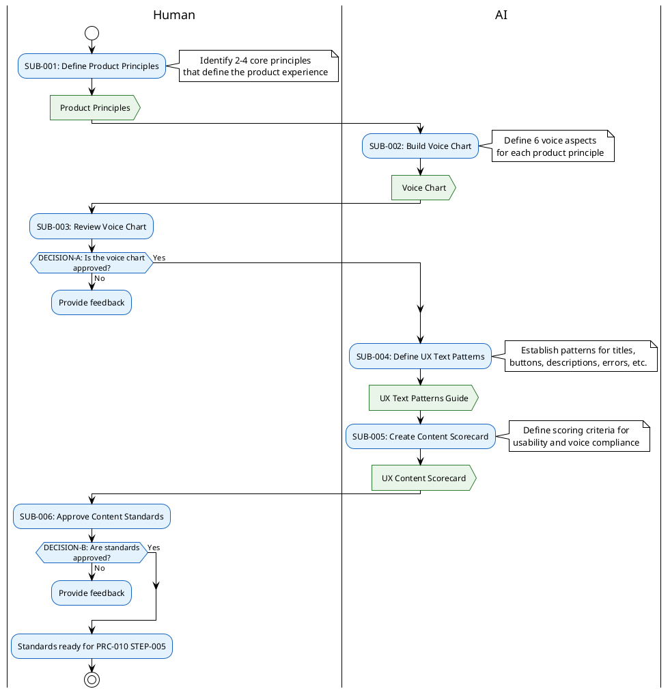

# PRC-010A: UX Content Standards Subprocess

## Purpose
Establish consistent voice, tone, and writing standards for all documentation produced under PRC-010. This subprocess must be completed before drafting begins (STEP-005) to ensure language consistency across all documents. Based on the methodology from *Strategic Writing for UX* (Podmajersky, 2019).

## Relationship to PRC-010
This subprocess runs as a **prerequisite to STEP-005 (Draft Documentation)**. It produces the Voice Chart, UX Text Patterns guide, and Content Scorecard that writers reference during drafting (STEP-005), self-review (STEP-006), and product walkthrough (STEP-007).

```
PRC-010 Flow:
  STEP-001 → STEP-002 → STEP-003 → STEP-004 → [PRC-010A] → STEP-005 → ...
```

## Process Overview


Fig 1: UX Content Standards subprocess overview

## Process Description

### SUB-001: Define Product Principles

#### Process Guidelines
- **Identify 2-4 product principles** that define what the experience is trying to be for the people who use it
- Product principles are **not features** — they are qualities (e.g., "Efficient", "Trustworthy", "Accessible")
- **Sources for principles**:
  - Existing brand guidelines or marketing materials
  - Stakeholder interviews (what should people feel when using this product?)
  - Competitor analysis (how do you want to differentiate?)
  - Mission statement or product vision
- Each principle should be a **single word or short phrase** that is distinct from the others
- Principles should be **ratifiable** by organizational leadership

#### Output Description
- **Product Principles**: 2-4 named principles with brief descriptions of what each means for the experience

### SUB-002: Build Voice Chart

#### Process Guidelines
- Create a voice chart with **product principles as columns** and **six voice aspects as rows**
- For each cell, define how that voice aspect should be applied to support that product principle

**The six voice aspects:**

| Aspect | What It Defines | Example Questions |
|--------|----------------|-------------------|
| **Concepts** | Ideas and topics to emphasize at every opportunity | What themes should surface even outside the direct task? |
| **Vocabulary** | Word choices, terminology, jargon policy | Technical terms or plain language? Industry-specific or accessible? |
| **Verbosity** | How much text to use | Terse and minimal? Thorough and detailed? Depends on context? |
| **Grammar** | Sentence structure, tense, person | Active voice? Second person ("you")? Imperative for actions? |
| **Punctuation** | Punctuation style and usage | Oxford comma? Exclamation marks? Periods in UI labels? |
| **Capitalization** | Capitalization conventions | Sentence case? Title case? ALL CAPS for emphasis? |

- **Voice vs. Tone**: Voice is consistent across the experience. Tone varies by context (error messages vs. success messages vs. onboarding). The voice chart accommodates both through its multiple columns.
- Use the voice chart template: [VOICE_CHART_TEMPLATE.md](VOICE_CHART_TEMPLATE.md)

#### Output Description
- **Voice Chart** using [VOICE_CHART_TEMPLATE.md](VOICE_CHART_TEMPLATE.md)

### SUB-003: Review Voice Chart

- **Purpose**: Human reviews and approves the voice chart for alignment with brand and product goals
- **Responsibility**: Human (product owner, brand stakeholder)
- **Review criteria**:
  - Principles accurately represent the product's intended experience
  - Voice aspects are specific enough to guide writing decisions
  - Voice aspects are flexible enough to allow tonal variation
  - No contradictions that would confuse writers

### SUB-004: Define UX Text Patterns

#### Process Guidelines
- For each **UX text pattern** that appears in the documentation, define the writing rules aligned to the voice chart
- Apply the voice chart to each pattern type to produce concrete guidance

**UX text patterns to define:**

| Pattern | Where It Appears | Key Decisions |
|---------|-----------------|---------------|
| **Titles** | Page titles, section headers | Length, capitalization, verb usage |
| **Buttons & Links** | CTAs, navigation links | Word count (≤3 words), imperative vs. descriptive |
| **Descriptions** | Intro paragraphs, feature descriptions | Max length, level of detail |
| **Empty States** | Zero-data screens, blank sections | Tone, call-to-action inclusion |
| **Labels** | Form fields, UI element labels | Capitalization, punctuation |
| **Controls** | Toggle text, dropdown options | Grammar consistency |
| **Text Input Fields** | Placeholder text, helper text | Example format, hint style |
| **Transitional Text** | Loading, processing, redirecting | Verb tense, reassurance level |
| **Confirmation Messages** | Success states, completion | Tone, detail level |
| **Notifications** | Alerts, updates, reminders | Urgency framing, action clarity |
| **Errors** | Error messages, validation | Blame-free language, recovery guidance |

- Not all patterns apply to every project — mark patterns as N/A when they don't appear
- Use the UX text patterns template: [UX_TEXT_PATTERNS_TEMPLATE.md](UX_TEXT_PATTERNS_TEMPLATE.md)

#### Output Description
- **UX Text Patterns Guide** using [UX_TEXT_PATTERNS_TEMPLATE.md](UX_TEXT_PATTERNS_TEMPLATE.md)

### SUB-005: Create Content Scorecard

#### Process Guidelines
- Define a **scoring rubric** used during self-review (STEP-006) and product walkthrough (STEP-007) to evaluate content quality
- The scorecard has two categories:

**Usability Criteria:**

| Criterion | What to Score |
|-----------|--------------|
| **Accessible** | Available in required languages; reading level appropriate; screen reader text present |
| **Purposeful** | Person's goals clear; organization's goals met |
| **Concise** | Buttons ≤3 words; text <50 chars wide, <4 lines; only relevant info shown |
| **Conversational** | Words/phrases familiar to audience; steps in logical order |
| **Clear** | Actions have unambiguous results; same term = same concept; errors help user move forward |

**Voice Criteria** (scored against the voice chart):

| Criterion | What to Score |
|-----------|--------------|
| **Concepts** | Intended themes present where appropriate |
| **Vocabulary** | Terminology matches voice chart definitions |
| **Verbosity** | Text length aligns with verbosity guidelines |
| **Grammar** | Sentence structure matches grammar rules |
| **Punctuation** | Punctuation follows defined conventions |
| **Capitalization** | Capitalization follows defined conventions |

- Each criterion is scored **0-10** with comments
- Use the content scorecard template: [UX_CONTENT_SCORECARD_TEMPLATE.md](UX_CONTENT_SCORECARD_TEMPLATE.md)

#### Output Description
- **UX Content Scorecard** using [UX_CONTENT_SCORECARD_TEMPLATE.md](UX_CONTENT_SCORECARD_TEMPLATE.md)

### SUB-006: Approve Content Standards

- **Purpose**: Human reviews and approves the complete content standards package
- **Responsibility**: Human (document owner, product stakeholder)
- **Review criteria**:
  - Voice chart, text patterns, and scorecard are internally consistent
  - Standards are practical and usable by the writing team
  - Scorecard criteria are relevant to the project's documentation needs
- **Outcome**: Approved standards become the reference for PRC-010 STEP-005 through STEP-007

## Decision Point Description

### DECISION-A: Is the voice chart approved?
- **Criteria**:
  - **Yes**: Principles are clear, voice aspects are well-defined, no contradictions
  - **No**: Missing aspects, unclear guidance, misaligned with brand
- **Outcomes**:
  - **Yes**: Proceed to SUB-004
  - **No**: Return to SUB-002 with feedback

### DECISION-B: Are standards approved?
- **Criteria**:
  - **Yes**: Text patterns and scorecard are consistent with voice chart and practical for use
  - **No**: Gaps in pattern coverage, scorecard criteria unclear or incomplete
- **Outcomes**:
  - **Yes**: Standards ready for PRC-010 STEP-005
  - **No**: Return to SUB-004 with feedback

## Integration with PRC-010

### How Standards Are Used in PRC-010 Steps

| PRC-010 Step | How Standards Apply |
|-------------|-------------------|
| **STEP-005: Draft Documentation** | Writers reference Voice Chart and UX Text Patterns while drafting |
| **STEP-006: Self-Review Edit** | Add **Pass 5: Voice Compliance** — check content against Voice Chart using the editing phases (Purposeful → Concise → Conversational → Clear) |
| **STEP-007: Product Walkthrough** | Use Content Scorecard to score each document against the live product |
| **STEP-008: Peer Review** | Reviewer uses Scorecard as structured evaluation rubric |

### Editing Phases (from Strategic Writing for UX)
During STEP-006 Self-Review, apply these four editing phases in order:

1. **Purposeful**: Does the text meet its purpose for both the person and the organization?
2. **Concise**: Is the text as short as possible while retaining meaning? (≤50 chars wide, ≤4 lines)
3. **Conversational**: Would the text feel natural if spoken aloud? Is it recognizable as the product's voice?
4. **Clear**: Will the reader understand immediately, without having to think?

## Process Compliance

This subprocess follows the standards defined in [process-document-guidelines.md](../prc-000/process-document-guidelines.md) and is controlled by [PRC-010](prc-010-documentation-creation-process.md).
